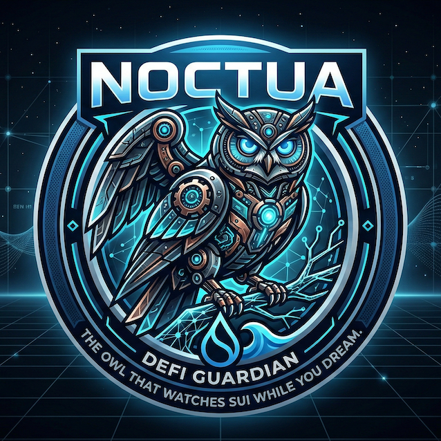

<p align="center">
  
</p>

<h1 align="center">Watchdog — Your DeFi Guardian That Never Sleeps</h1>

<p align="center"><em>Unlike a real watchdog — this one never sleeps.</em></p>

Watchdog is an autonomous AI agent built on **OpenClaw** that monitors your **NAVI Protocol** lending positions on **Sui**, uses an **LLM** (e.g. Gemini, GPT, Claude — configurable) for intelligent risk analysis, and communicates with you via **Telegram** — all running locally with your private key never leaving your device.

## The Problem

DeFi lending positions can be liquidated during market crashes, causing up to 35% collateral loss. Users lose money not because their thesis was wrong, but because they were asleep.

## The Solution

Watchdog monitors your Health Factor continuously, uses an **LLM** to analyze trends and make intelligent decisions, and executes **atomic flash loan unwinds** via a single Sui PTB when danger is detected:

```
Flash Loan debt tokens → Repay debt → Withdraw collateral → Swap → Repay flash loan
```

All in one atomic transaction. If any step fails, everything reverts. No partial state risk.

### Real-World Example

A user supplies **1 SUI** (~$0.89) as collateral and borrows **0.50 nUSDC** on NAVI Protocol. SUI price drops, and the Health Factor falls to **1.42** — below the configured trigger of 1.5.

Watchdog detects this and executes the following **in a single atomic transaction**:

```
┌────────────────────────────────────────────────────────────────┐
│  User position: 1 SUI collateral, 0.50 nUSDC debt (HF=1.42)  │
│                                                                │
│  1. Flash loan 0.24 USDC from NAVI                             │
│  2. Repay 0.24 nUSDC debt → debt drops to 0.26 nUSDC          │
│  3. Withdraw 0.27 SUI (now unlocked) from collateral           │
│  4. Swap 0.27 SUI → 0.24 USDC via Cetus DEX                   │
│  5. Repay flash loan with swapped USDC                         │
│  6. Return leftover to user's wallet                           │
│                                                                │
│  Result: 0.73 SUI collateral, 0.26 nUSDC debt → HF restored ✅│
│  Cost: only gas + swap fee (~0.03 SUI)                         │
│  Time: 1 transaction, ~1 second                                │
└────────────────────────────────────────────────────────────────┘
```

TX: [`9VqeBU...`](https://suiscan.xyz/mainnet/tx/9VqeBUPdBCjwLD4LxqcP7gdDxoL4djUNxFZKz7k2MLQe) | Audit: [Walrus](https://aggregator.walrus-testnet.walrus.space/v1/blobs/ERhJKNU1lrxXdaZ5utsS1CGFfIJc92aKFnl9VQCVET8)

Without Watchdog, the user would need to manually monitor, prepare USDC, and execute multiple transactions — or risk a **35% liquidation penalty**.

## Architecture

```
  Telegram (remote control & alerts)
       │
       ▼
┌──────────────────────────────────┐
│         Telegram Bot             │
│  /status /history /rule          │
│  Natural language → LLM          │
│  Push alerts ← Monitor          │
└──────────┬───────────────────────┘
           │
           ▼
┌──────────────────────────────────┐
│      LLM Brain (pluggable)       │
│  Chat: function-calling tools    │
│  Monitor: structured analysis    │
│  Trend: HF history analysis      │
└──────────┬───────────────────────┘
           │ tools
           ▼
┌──────────────────────────────────┐
│        Watchdog Core             │
│  NaviClient (position query)     │
│  UnwindEngine (strategy calc)    │
│  FlashloanUnwind (atomic PTB)    │
│  WalrusLogger (audit trail)      │
└──────────┬───────────────────────┘
           │
           ▼
     Sui Blockchain
  NAVI + Aggregator + Walrus
```

## Quick Start

```bash
# 1. Clone and install
git clone https://github.com/cl-fi/noctua.git
cd noctua
npm install

# 2. Configure
cp .env.example .env
# Edit .env:
#   SUI_PRIVATE_KEY     - your Sui private key
#   TELEGRAM_BOT_TOKEN  - from @BotFather
#   GEMINI_API_KEY      - from Google AI Studio (or swap for your preferred LLM)

# 3. Build
npm run build

# 4. Start — HF thresholds auto-calibrated by LLM + market data
node dist/cli.js start

# Or manually set thresholds (skips auto-calibration)
node dist/cli.js start --trigger 1.5 --target 2.0
```

## Telegram Commands

| Command | Description |
|---------|-------------|
| `/start` | Register for alerts |
| `/status` | Current HF & position breakdown |
| `/history` | Recent unwind operations + Walrus links |
| `/rule` | View protection rule |
| Any text | Natural language chat with LLM |

**Example conversations:**
- *"Is my position safe?"*
- *"What happened last night?"*
- *"Set trigger to 1.4"*
- *"Show me the audit trail for the last unwind"*

## CLI Commands

| Command | Description |
|---------|-------------|
| `watchdog start` | Start daemon with auto-calibrated HF thresholds |
| `watchdog start --trigger 1.5 --target 2.0` | Start with manual HF thresholds |
| `watchdog stop` | Stop daemon |
| `watchdog status` | Current HF, position, monitoring state |
| `watchdog history` | Recent unwinds with Walrus audit trails |
| `watchdog trace <blobId>` | Read full Walrus audit trace |
| `watchdog set-rule --trigger 1.4` | Update protection rules |

## LLM Brain (Pluggable)

Unlike simple threshold-based bots, Watchdog uses an **LLM** for intelligent decision-making. The default implementation uses Gemini 3 Flash, but the LLM layer is designed to be swapped for any provider (GPT, Claude, Llama, etc.):

- **Auto-Calibration**: On startup, fetches SUI price volatility (72h CoinGecko data) and uses LLM to recommend optimal trigger/target HF — no manual tuning needed
- **24h Recalibration**: Automatically re-evaluates thresholds every 24 hours as market conditions change
- **Trend Analysis**: Tracks HF history (last 20 checks / ~5 min) to detect rapid declines
- **Smart Warnings**: Warns when HF is dropping fast, even if still above trigger
- **Natural Language**: Chat with your guardian in plain language via Telegram
- **Tool Calling**: LLM can query positions, view history, update rules, and execute unwinds

## Sui Stack Integration

| Component | Usage |
|-----------|-------|
| **Sui Blockchain** | Sub-second finality for fast reactions |
| **NAVI Protocol** | Lending position monitoring + flash loans |
| **NAVI Aggregator** | Best-route DEX swap execution |
| **Walrus** | Immutable, decentralized audit trail storage |

## Why Flash Loan Unwind?

Traditional multi-step unwind (withdraw → swap → repay) has a critical flaw: if the swap fails after withdrawal, your position is **worse** than before. Flash loan atomic unwind solves this:

1. **Atomic**: All-or-nothing. Either the entire unwind succeeds or nothing happens.
2. **Capital efficient**: No need to hold debt tokens in wallet.
3. **Faster**: Single transaction vs. multiple sequential transactions.
4. **Safer**: Zero partial state risk.

## Security

- Private keys **never leave your machine**
- All transactions signed locally
- Every action logged to Walrus (immutable audit trail)
- LLM cannot access keys — only calls predefined tools
- Telegram bot requires `/start` registration

## Tech Stack

- TypeScript / Node.js
- navi-sdk (NAVI Protocol SDK + Aggregator)
- @mysten/sui (Sui TypeScript SDK)
- grammY (Telegram Bot)
- @google/genai (Gemini AI — default LLM, swappable)
- OpenClaw (Agent framework)
- Walrus (Decentralized storage)

## License

MIT

---

*Built with ❤️ during the OpenClaw x Sui Hackathon (March 2026)*
*Developed primarily by AI agents, supervised by humans who have been liquidated one too many times.*
